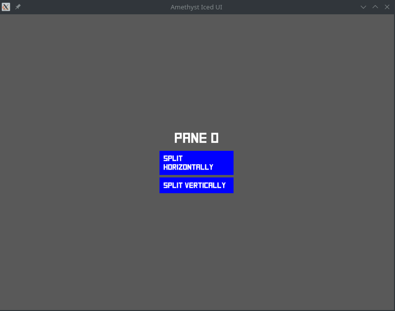
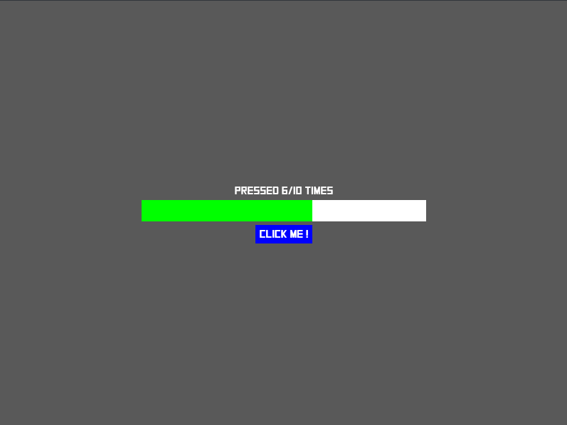

# Amethyst-Iced

An Amethyst addon to create your game UI using Iced. 

## Features

* Plug-and-play, just add a Render Plugin and a Bundle to your GameData, then get started using Iced
* Most (but not all) components of `iced_native` are usable
* Correctly handles resizing. Responsive Game UIs ftw !

Very much a WIP. If you want a full-featured solution, please consider contributing :)

## Motivation 

Writing UIs is both complex and important for video games. As [Amethyst](https://github.com/amethyst/amethyst) strives to be a powerful and feature-complete game engine, and [Iced](https://github.com/hecrj/iced) an easy-to-use and type-safe GUI library, I thought it would be a good idea to glue them together, and provide an alternative to Amethyst's built-in UI System. 

## Demo 

Available examples: 

* `hello`, demonstrating sample text in different colors
* `counter`, counting how many clicks on a button
* `image`, demonstrating Image widget with Amethyst's texture handling
* `slider`, demonstrating Iced's slider widget
* `checkbox`, demonstrating Iced's checkbox widget
* `pane_grid`, demonstrating Iced's pane grid widget
* `progress_bar`, demonstrating Iced's progress bar widget
* `radio`, demonstrating Iced's radio widget (they look like checkboxes right now, I know)

To run an example just launch `cargo run --example hello --features vulkan`.
Other Amethyst backends may work but are untested.

## Usage 

See the examples. Sorry for the lack of comments.

## Todo-list

* Improve the global code quality of the codebase and of the examples. This crate is poorly documented, and was written merely as a proof of concept. 
* Review/Audit the IcedUI Rendy plugin as I am confident I have done a horrible job at "Rendy best practices". 
* Review/Audit/Refactor hacky and inefficient custom font loading for Text widgets
* Make helpers to make custom font easier to use
* Support spritesheet for Image widget
* Support nine-patch for Image widget (more on that below)
* Fix radio buttons so they don't look like Checkboxes. Broadly speaking, design a way of using Lyon to render shapes, possibly getting inspiration from amethyst_lyon.  
* Support Iced's debugger
* Support Images and Nine-Patches using custom styling for a variety of widgets where it would be applicable : 
    * Buttons, 
    * Checkboxes, 
    * Sliders, 
    * Radio, 
    * Progress Bar 
* Write an example for actual game integration 
* Fix winit support which is in a poor state right now by using iced_winit once the Amethyst engine has done the transition to winit 0.20  
* Support for Futures (possibly iced_futures) and implementation of the Application trait like in the Iced base crate
* Implement Scrollable widget
* Implement TextInput widget
* Implement amethyst profiling
* Port more examples from iced
* Setup CI
* Add badges to this repository. This is a serious project, after all.

Help would be appreciated ! :)
